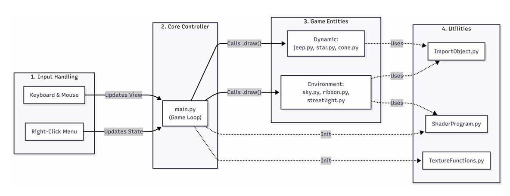
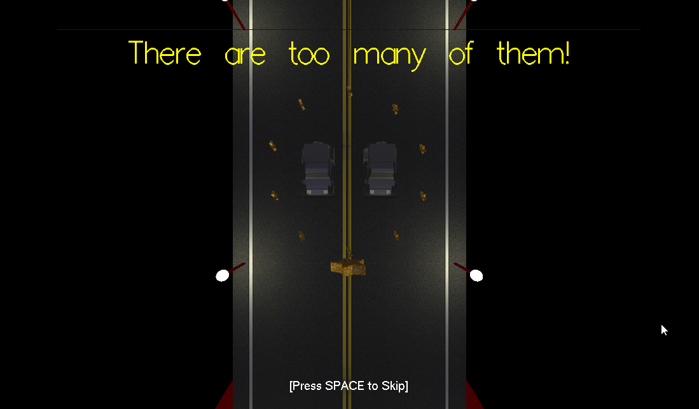
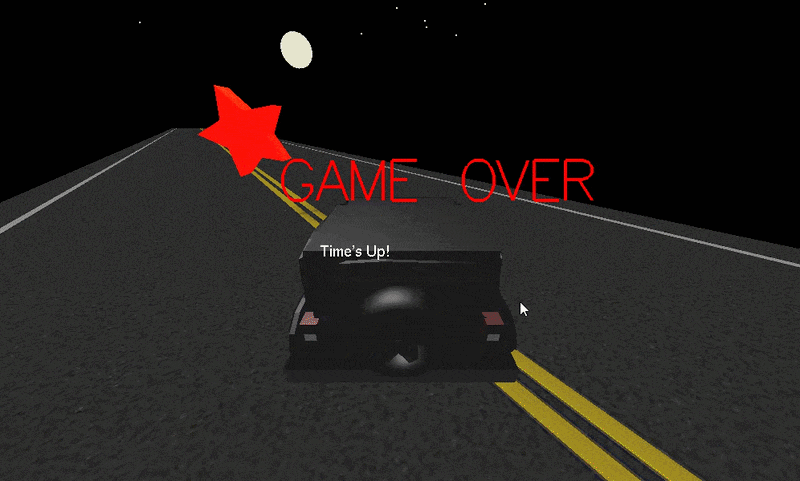

# CS4182_Project

Run the Executable 
Or run the souce_code:

*MAKE SURE YOUR ARE ON THE RIGHT ROOT (/ref_use_source_code)*

1. Open the Anaconda Prompt
2. Type the following Command
COMMAND:
conda create --name Jeepenv123 python=3.9
conda activate Jeepenv123
pip install PyOpenGL-3.1.7-cp39-cp39-win_amd64.whl
cd src
pip install -r requirements.txt
python main.py

---

# OpenGL 3D Driving Game

A real-time 3D driving game built with **Python** and **PyOpenGL**, showcasing modern computer graphics concepts including programmable shaders, procedural content generation, dynamic lighting, and collision detection.

## High-level system architecture

## Features

- Interactive 3D driving gameplay with multiple camera modes
- Dynamic lighting system (directional, point, and spotlight)
- GLSL Blinn-Phong shader for realistic lighting
- Procedurally generated infinite road
- Collectibles, obstacles, collision detection, and boss battle
- Speed boost mechanics with acceleration ribbons
- OBJ model loading and custom NURBS surface rendering
- Adjustable resolution and fullscreen support

## Tech Stack

- Python
- PyOpenGL
- GLSL
- GLUT
- PIL (Texture Loading)

## Demo

  
  

  
  

## What I Learned

- Real-time rendering pipeline
- OpenGL lighting and shader programming
- Procedural world generation
- 3D transformations and camera systems
- Collision detection and game state management